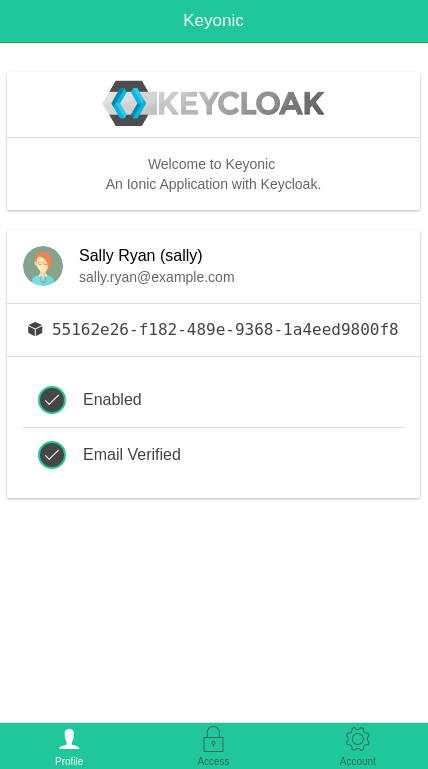
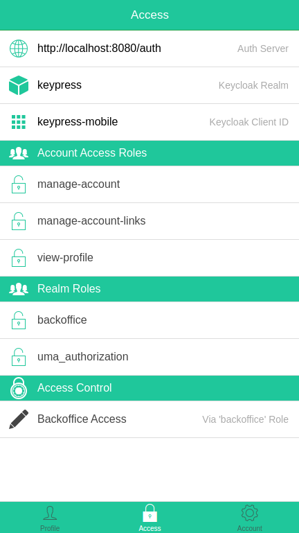
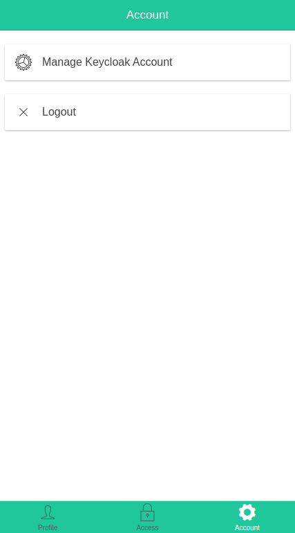

# Keyonic
## Description
Keycloak with Ionic & Angular.

## Setup
Run `ionic serve --address localhost` to start the application.

Ensure that you have the Web Origin configured in Keycloak. eg `*` or other.

## Keycloak Configuration
The following configuration was used for this application.

```
var keycloak = Keycloak({
  "realm": "keypress",
  "url": "http://localhost:8080/auth",
  "ssl-required": "external",
  "clientId": "keypress-mobile",
  "public-client": true,
  "use-resource-role-mappings": true
});
```

## Access Control Functionality
Some UI elements are shown/hidden under the Access tab based on the logged in users role. These roles are:
* admin
* driver
* management
* backoffice

## Example UI
### User Profile
The user profile screen will show information about the logged in user. You can also retrieve user Attributes this way.


### User Access
From here, you can see what auth server you have authenticated against, the realm you are using, and the client that you are interacting with Keycloak through. You can also see what Account Access Roles and Realm Roles have been granted to the user. Lastly, the Access Control list will show a role name UI element if they have that role, otherwise a role name UI component will not be shown if they do not have that role


### User Account
The account tab will allow you to manage your account (update some details like your password etc) and also logout.
